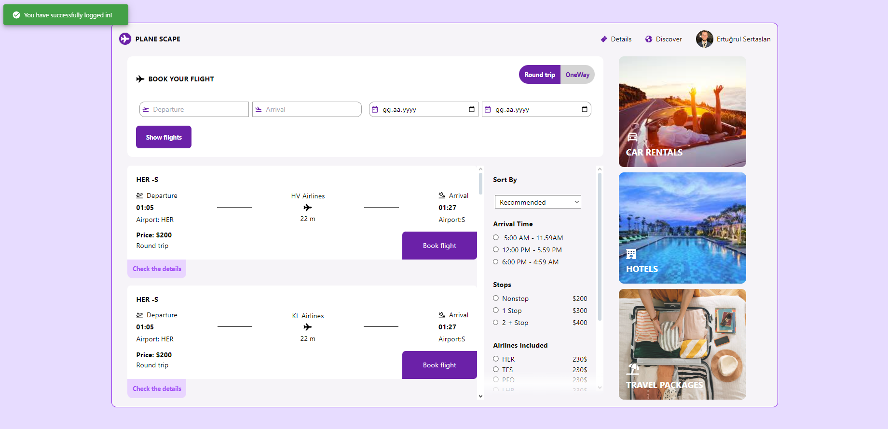
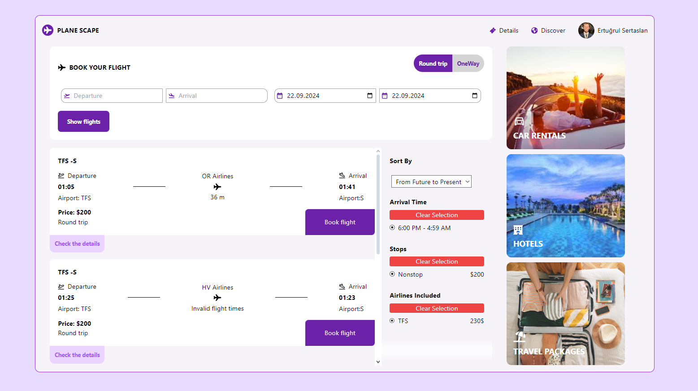
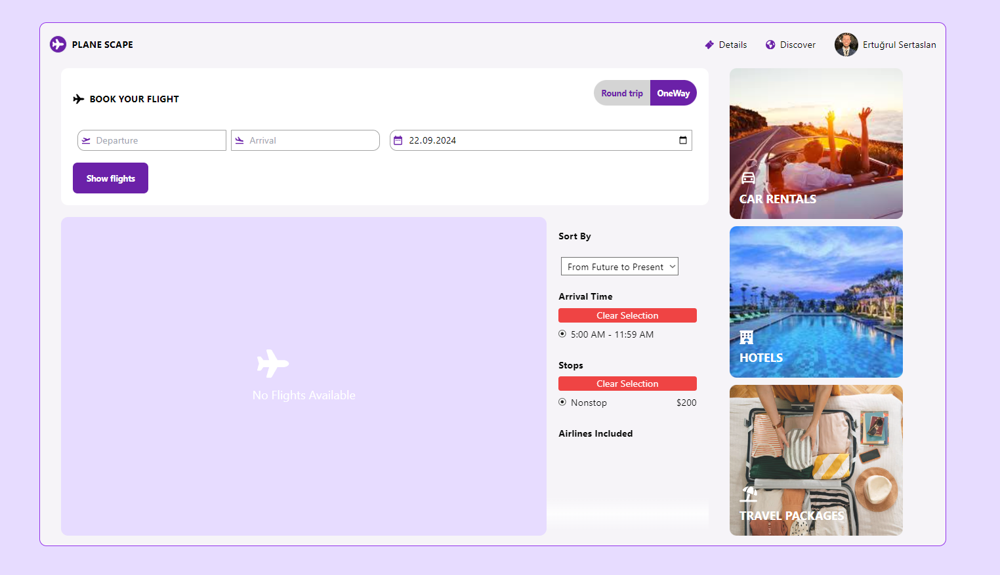
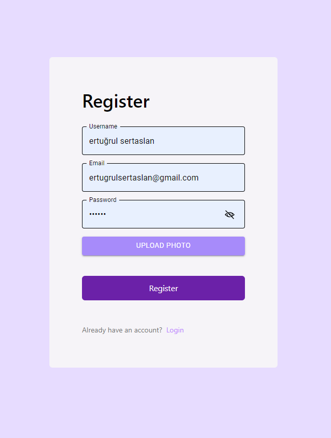
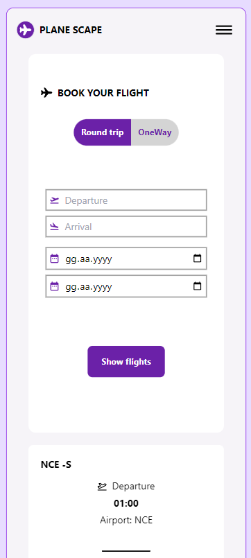
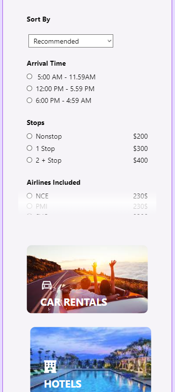
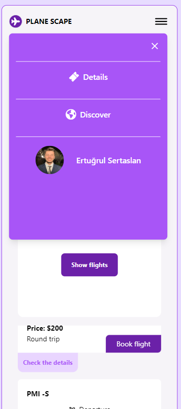
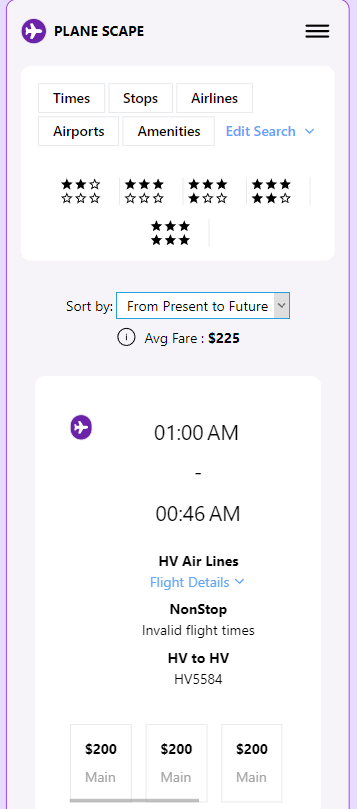

# Plane Scape ✈️🌍


Plane Scape is a web application designed for users to search, filter, and book flights easily, offering a seamless travel planning experience.

## Screenshots 📸
<div>
    <h3>Home Page 🎥</h3>
    
</div>
<div style="display: flex; flex-direction: row;">
  <h3>Flights Page ✈️</h3>
    

  <h3>Filter Home Page 🔍</h3>
    
    
</div>
<div style="display: flex; flex-direction: row;">
  <h3>Login And Register Page 🔐</h3>
    
   
</div>
<div>
 <div style="display: flex; flex-direction: row;">
<h2>Mobile Screens 📸 📱 ⬇️</h2>
</div>
<div style="display: flex; flex-direction: row;">

  <h3>Home Page 📱</h3>
    
    
 
</div>
 <h3>Flights Page ✈️</h3>
    


## Features ✨

- **🛫 User Registration & Login:** Users can create accounts and log in to access personalized features.
 for each transaction.
- **✈️ Flight Browsing:** Browse through available flights with detailed information.
- **🔍 Advanced Filtering:** Filter flights by airport, date, time, layovers, and direction (one-way or round-trip).
- **🗓️ Reservation Management:** Users can reserve flights, with bookings listed on their flights page.
- **🖼️ Responsive Design:** Adaptable interface that works on different screen sizes.
- **🚫 Animation on No Results:** Engaging animations display when no flights match the selected filters.
- **🔔 Notification Messages:** Error and success notifications are displayed throughout the application for user actions such as registration, login, filtering and reservation.

## Technologies Used 💻

### Frontend 🌐
- 📦 [Vite](https://vitejs.dev/) - Module bundler 
- 💻 [React.js](https://reactjs.org/) - JS library for crafting user interfaces
- 🎨 [Tailwind CSS](https://tailwindcss.com/) - A utility-first CSS framework
- ⚙️ [Material-UI (MUI)](https://mui.com) - React components for faster and easier web development.
- 🖼️ [React Icons](https://react-icons.github.io/react-icons/) - A library of popular icons for React applications
- 📬 [Notistack](https://notistack.com/) - Notification library for React
- 🌐 [Axios](https://axios-http.com) - Promise-based HTTP client for making API requests.
- 🛤️ [React Router](https://reactrouter.com/en/main) - Declarative routing for React applications.

 ### Backend 🔧 
- 🚀 [Express.js](https://expressjs.com/) - Web framework for Node.js
- 🌐 [Cors](https://www.npmjs.com/package/cors/) - Mechanism for integrating applications
- ⚙️ [Dotenv](https://www.npmjs.com/package/dotenv/) - A zero-dependency module that loads environment variables from a .env file into process.env
- 🔒 [Bcrypt](https://www.npmjs.com/package/bcrypt/) - A library to help you hash passwords.
- 📂 [Multer](https://www.npmjs.com/package/multer/) - A middleware for handling multipart/form-data in Node.js, primarily used for uploading files.
- 💾 [Google Cloud Storage:](https://www.npmjs.com/package/@google-cloud/storage/) -  For interacting with Google Cloud Storage.
- 🧁 [Body-parser](https://www.npmjs.com/package/body-parser/) - Middleware for parsing the body of HTTP requests.
- 🍪 [Cookie-parser](https://www.npmjs.com/package/cookie-parser/) - For handling cookies.
- 🔑 [Jsonwebtoken](https://www.npmjs.com/package/jsonwebtoken/) - For creating and verifying JSON Web Tokens.
- 👨‍💻 [Nodemon](https://nodemon.io/) - Automatically restarts the application when file changes are detected.

 ### Database 🗃️
- 🛢️ [Prisma](https://www.prisma.io/) - Prisma ORM is an open-source next-generation ORM
- ☘️ [MongoDB Atlas Cloud Database](https://www.mongodb.com/products/platform/cloud) - Cloud-based NoSQL database for storing and managing data.
- ☁️ [Google Cloud Console](https://www.prisma.io/) - Platform for managing Google Cloud services, including Cloud Firestore and Google Cloud Storage.


## Installation 🛠️

Prerequisites

- Install Node.js ⚙️
- Clone the repo 🔄

 📦 After cloning the repo install dependecies with

1. Open up two terminal instances and run scripts below in directories `/server` and `/client`

- Server 🌐
 ```sh 
    npm i && npm run dev
```
- Client 📱
 ```sh 
    npm i && npm run dev
```
after running scripts go to `http://localhost:5173` with your browser to use the app. 🌐

### API Usage: Schiphol Airport Flights ✈️

To list flights from Schiphol Airport, you need to use the Flight V4 API. Follow these steps:

1. **Create an Account:** 
   - Sign up for a free account at [Schiphol Developer Portal](https://developer.schiphol.nl).

2. **Obtain Credentials:🔑**
   - After creating an account, retrieve your Application ID and Application Key for the Flight V4 API.

3. **API Endpoint:**
   - Use the endpoint for fetching flights. No additional external processes are required.

You will use these credentials in your application to make API requests. 

### Setting Up the .env File ⚙️

1. **Cloning the Project:** 🔄
   - Once you've cloned the project, you'll need to create a `.env` file.
   - I've included an .env.example file with detailed instructions on which environment variables the project requires and how to set them up.
    
2. **Creating the .env File:** 📝
   - Start by copying the `.env.example` file and creating a new file named `.env`.
   - Make sure to fill in the contents of the `.env` file.


3. **Defining Environment Variables:** 🔧

 - In the `.env` file, define the following variables for your API calls:

   ```sh
     # API credentials
       APPLICATION_ID=your_application_id
       API_KEY=your_api_key

     # Base URL for the API
       BASE_URL=https://api.yourservice.com/v1/flights
   ```
- Or you can use json web token and db

   ```sh
     # API credentials
       ACCESS_SECRET_TOKEN=your_access_token
       REFRESH_SECRET_TOKEN=your_refresh_token
       DATABASE_URL=your_db_url
   ```


# User Photo Storage in Google Cloud Storage 📷☁️

This section outlines the steps to store user-uploaded photos in a Google Cloud Storage bucket within your application.

## Steps to Store User Photos 📸

### 1. Set Up Google Cloud Project 🌐
- Go to the [Google Cloud Console](https://console.cloud.google.com/).
- Create a new project or select an existing one.

### 2. Enable Cloud Storage API ⚡
- Navigate to **APIs & Services** > **Library**.
- Search for **Cloud Storage** and enable the API.

### 3. Create a Cloud Storage Bucket 🗄️
- Go to **Cloud Storage** > **Buckets**.
- Click on **Create Bucket**.
- Choose a globally unique name and select the desired location and storage class.

### 4. Set Permissions 🔑
- Under **Permissions**, set the necessary roles for your application to access the bucket (e.g., `Storage Object Admin`).
- If using service accounts, create one and download the JSON key.

### 5. Install Google Cloud Storage Client Library 💻
- In your Node.js project, run:

    ```sh
     npm install @google-cloud/storage
    ```
### 6. Configure Authentication 🔒
- Set the environment variable for Google credentials:

  ```sh 
   export GOOGLE_APPLICATION_CREDENTIALS="path/to/your/service-account-file.json"
  ```
### 7. Implement File Upload Logic 📤

- Use Multer to handle file uploads in your Express app:
 ```sh 
   import multer = from 'multer';
   import  { Storage } from "@google-cloud/storage";

   const storage = new Storage();
   const bucket = storage.bucket('your-bucket-name');

   const upload = multer({ storage: multer.memoryStorage() });

 app.post('/upload', upload.single('photo'), (req, res) => {
   const blobStream = bucket.file(req.file.originalname).createWriteStream({ resumable: false });

  blobStream
    .on('error', (err) => res.status(500).send(err))
    .on('finish', () => res.status(200).send('File uploaded successfully.'))
    .end(req.file.buffer);
});
```
### 8. Access Uploaded Files 📂
- Files can be accessed via their public URLs if set, or programmatically through the Google Cloud Storage client.

## Usage Details 📋

1. **User Registration and Login** 🔐: To use the application, you need to create an account first. After registering, you can log in to access personalized features.

2. **Flight Search** ✈️: From the homepage, you can search for available flights and view detailed information. You can filter search results by airport, date, time, and number of layovers.

3. **Reservation Management** 🗓️: After making a flight reservation, you can view your bookings on the "My Flights" page.

4. **Responsive Design** 📱: The application adapts to different screen sizes, providing a seamless experience on mobile devices.

5. **Notifications** 🔔: You will receive error and success notifications for actions such as registration, login, filtering, and reservation.


## License 📄

[MIT](https://choosealicense.com/licenses/mit/)
